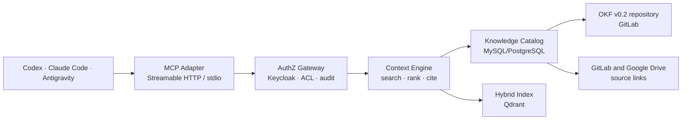

# ReqSpec / PRD — Knowledge Context MCP Server

**Versión:** 1.0  
**Fecha:** 30 de agosto de 2026  
**Estado:** Aprobado para implementación  
**Producto:** Plataforma de Gestión de Conocimiento para Desarrollo de Software — COMSATEL  
**Destinatario:** Equipo de arquitectura, desarrollo, QA y agentes de codificación

---

## 1. Propósito

Construir un servidor **Model Context Protocol (MCP)** de lectura que entregue contexto técnico, funcional y de delivery con procedencia verificable a Codex, Claude Code, Antigravity y otros harnesses compatibles.

El servidor debe permitir a una persona o agente encontrar conocimiento aprobado, recuperar el fragmento mínimo necesario y conocer su origen, versión, vigencia y restricciones de acceso. No será un chatbot ni reemplazará las fuentes de verdad.

## 2. Contexto y problema

El conocimiento de productos y delivery se encuentra distribuido entre:

- GitLab: Issues, Merge Requests, repositorios, ADR, código, pruebas y evidencias. Es el registro oficial para trazabilidad de trabajo y cambios.
- Repositorio dedicado de conocimiento: conocimiento curado y versionado en Google Open Knowledge Format (OKF) v0.2.
- Google Drive y carpetas seleccionadas: documentos PDF, Markdown y otros materiales de referencia.
- Esquemas de MySQL, PostgreSQL y MongoDB: metadatos y estructura técnica, sin copiar datos operativos por defecto.

La dispersión incrementa el tiempo de búsqueda de contexto, genera respuestas sin evidencia y concentra conocimiento en personas clave. El objetivo del piloto es arquitectura y delivery: PRD, ADR, historias, criterios, decisiones, componentes, integraciones y evidencias.

## 3. Objetivos y métricas de éxito

### 3.1 Objetivos

1. Reducir el tiempo para hallar contexto técnico y decisional confiable.
2. Mejorar la calidad y consistencia de PRD, ADR, historias y entregables.
3. Reducir la dependencia de conocimiento tácito, conservando gobierno humano.
4. Proveer un contrato único y portátil para todos los harnesses de IA.

### 3.2 Indicadores del piloto

| Indicador | Meta inicial |
|---|---:|
| Preguntas de evaluación respondidas con al menos una cita válida | ≥ 90% |
| Respuestas sin evidencia que declaran insuficiencia de contexto | 100% |
| Consultas autorizadas con filtro ACL aplicado antes de recuperación | 100% |
| Latencia p95 de `search_knowledge` (índice caliente) | ≤ 2 s |
| Disponibilidad mensual del servicio MCP | ≥ 99.5% |
| Conjunto de evaluación de arquitectura/delivery | 30–50 preguntas reales |

## 4. Alcance

### 4.1 Incluido — MVP

- Servidor MCP en **TypeScript/Node.js**, compatible con MCP SDK, con transporte Streamable HTTP y `stdio` para desarrollo local.
- Recuperación híbrida sobre MySQL y Qdrant: metadatos/filtros, búsqueda léxica y semántica, fusión y re-ranking.
- Consultas con citas obligatorias hacia GitLab, OKF o Drive, incluyendo sección/página cuando aplique.
- Context Engine independiente del adaptador MCP para formar paquetes de contexto de tareas.
- Autenticación OAuth 2.1/OIDC mediante Keycloak, autorización por roles/grupos y ACL de cada artefacto.
- Auditoría de consultas y eventos de seguridad sin almacenar prompts completos ni secretos.
- Lectura de conocimiento `stable` aprobado; lectura de `draft` solo para perfiles autorizados y con advertencia explícita.
- Trazabilidad de fuente, revisión, hash de contenido, versión y relación de sucesión.

### 4.2 Incluido — preparación para fases siguientes

- Contratos y eventos para recibir índices de los conectores GitLab, Drive, almacenamiento de archivos e inventario de esquemas.
- Generación de conceptos OKF como `draft`, revisión humana por Merge Request y promoción a `stable` por la CI del repositorio de conocimiento.
- Extensión futura hacia grafo semántico/GraphRAG sin hacer a Neo4j una dependencia del MVP.

### 4.3 Fuera de alcance

- Crear, editar, aprobar o fusionar contenido desde MCP.
- Acceso a secretos, credenciales, tokens, datos transaccionales, tramas de telemetría o PII no autorizada.
- Copia masiva de archivos fuente o de bases de datos hacia las respuestas.
- Automatización de decisiones, cambios de código, despliegues o acciones GitLab desde el servidor.
- Interfaz web de administración y analítica avanzada de conocimiento.

## 5. Principios de diseño

1. **Fuente antes que síntesis:** cada respuesta debe exponer su evidencia y no presentar inferencias como hechos.
2. **GitLab es el registro oficial:** Drive aporta referencia; OKF representa conocimiento curado. Si hay conflicto, el resultado debe mostrar la precedencia y alertar la discrepancia.
3. **Knowledge as Code:** los conceptos OKF se versionan, validan y aprueban mediante Merge Request.
4. **Mínimo privilegio y filtro antes de recuperar:** los permisos se aplican en metadatos antes de consultar el contenido/vector.
5. **Lectura mínima:** el servidor devuelve extractos, no documentos completos, salvo una solicitud explícita y autorizada.
6. **El contenido recuperado no es una instrucción:** texto documental nunca puede activar herramientas de escritura ni cambiar las políticas del servidor.
7. **Motor desacoplado:** el Context Engine puede ser reutilizado por API interna, jobs de evaluación y MCP sin lógica duplicada.

## 6. Arquitectura objetivo



### 6.1 Componentes

| Componente | Responsabilidad | Tecnología inicial |
|---|---|---|
| MCP Adapter | Protocolo MCP, negociación de capacidades y mapeo de herramientas | TypeScript, MCP SDK |
| Transport layer | Streamable HTTP para OKE y `stdio` para uso local | Fastify, Node.js |
| AuthZ Gateway | Validar JWT, mapear grupos/roles, aplicar políticas y rate limit | Keycloak, JWKS, OPA opcional fase 2 |
| Context Engine | Filtrar, recuperar, fusionar resultados, aplicar reglas de confianza y crear citas | TypeScript, Zod |
| Knowledge Catalog | Metadatos, versiones, ACL, procedencia, estado y auditoría | MySQL 8.x; PostgreSQL aceptable si el programa KM lo adopta |
| Hybrid Index | Vectores densos/sparse, filtros y ranking híbrido | Qdrant |
| Knowledge Compiler | Validar bundles OKF y publicar proyecciones de índice tras MR aprobado | GitLab CI, Node.js |
| Ingestion Services | Extraer, normalizar, clasificar e indexar fuentes | Servicio separado; no es parte del proceso MCP síncrono |

## 7. Modelo de conocimiento, gobierno y procedencia

### 7.1 Estados

| Estado | Significado | Visibilidad por defecto |
|---|---|---|
| `draft` | Generado o propuesto; aún no validado por responsable | Solo autor/revisor y perfiles privilegiados |
| `stable` | Aprobado por responsable de dominio mediante MR | Usuarios autorizados |
| `deprecated` | Conservado como histórico; no recomendado | Devuelto solo con advertencia |
| `superseded` | Reemplazado por otro concepto | Solo si se solicita historia/linaje |
| `archived` | No operativo; evidencia histórica | Solo acceso explícito autorizado |

### 7.2 Reglas OKF v0.2

- Todo concepto curado debe ser un archivo Markdown con frontmatter OKF válido, identificador inmutable, título, tipo, dominio/producto, estado, clasificación, fuentes y fechas de vigencia.
- `stable` exige al menos una fuente trazable, un responsable de dominio y atestación/revisión humana registrada en GitLab.
- La CI debe rechazar frontmatter inválido, fuentes inexistentes, IDs duplicados, enlaces rotos, `stable` sin revisión y fechas de vigencia inconsistentes.
- La proyección al catálogo e índice se ejecuta únicamente desde la rama aprobada del repositorio OKF.

### 7.3 Registro mínimo por fragmento recuperable

```text
knowledge_id, concept_id, source_system, source_uri, source_revision,
content_hash, artifact_type, product, domain, status, classification,
acl_principals, section_path, page_range, chunk_text, embedding_version,
ingested_at, verified_at, stale_after, supersedes_knowledge_id
```

## 8. Personas y casos de uso

| Perfil | Necesidad principal | Resultado esperado |
|---|---|---|
| Analista Funcional | Entender alcance, reglas y dependencias | Contexto para historias, criterios y estimaciones con cita |
| Arquitecto de Aplicaciones | Consultar decisiones, estándares, integraciones e impacto | ADR y lineamientos vigentes, fuentes y sucesores |
| Desarrollador | Preparar un cambio sin perder restricciones del producto | Paquete de contexto de tarea, componentes y reglas de seguridad |
| QA | Comprender criterios, riesgos y evidencia de pruebas | Contexto verificable para plan/casos de prueba |
| Agente de IA | Recuperar contexto mínimo, autorizado y citable | Respuesta estructurada, sin acceso a secretos ni capacidad de mutación |

## 9. Contrato MCP

### 9.1 Recursos

| URI | Descripción |
|---|---|
| `km://artifact/{knowledge_id}` | Concepto o fragmento vigente autorizado |
| `km://artifact/{knowledge_id}/version/{revision}` | Versión inmutable específica |
| `km://taxonomy/{domain}` | Taxonomía y tipos de conocimiento por dominio |

### 9.2 Herramientas

| Herramienta | Propósito |
|---|---|
| `search_knowledge` | Busca conocimiento autorizado por texto y filtros de producto/dominio/estado/tipo/confianza. |
| `get_knowledge_excerpt` | Devuelve el extracto exacto de un resultado con localizador y cita. |
| `get_artifact_lineage` | Entrega fuente, revisiones, relaciones, sucesores y vigencia. |
| `build_context_pack` | Compone contexto limitado por presupuesto de tokens para una tarea. |
| `get_task_context` | Recupera contexto a partir de Issue/MR, módulo, componente o identificador de requerimiento. |
| `get_provenance` | Devuelve evidencia, hash, URI canónica, atestación y restricciones de uso. |
| `list_stale_concepts` | Lista conceptos potencialmente desactualizados de un dominio autorizado. |

### 9.3 Esquemas de entrada y salida

Todas las entradas y salidas se validan con Zod. Los filtros se evalúan antes de la búsqueda vectorial.

```ts
type KnowledgeFilters = {
  product?: string[];
  domain?: string[];
  artifactType?: string[];
  status?: Array<'stable' | 'draft' | 'deprecated' | 'superseded' | 'archived'>;
  verifiedOnly?: boolean;
  staleAllowed?: boolean;
  sourceSystem?: Array<'gitlab' | 'google-drive' | 'okf' | 'schema-catalog'>;
};

type Citation = {
  knowledgeId: string;
  title: string;
  sourceUri: string;
  sourceRevision: string;
  locator: { sectionPath?: string; pageRange?: string; lineRange?: string };
  status: string;
  verifiedAt?: string;
};

type SearchKnowledgeInput = {
  query: string;
  filters?: KnowledgeFilters;
  limit?: number; // 1..20; default 8
};

type SearchKnowledgeResult = {
  results: Array<{
    knowledgeId: string;
    excerpt: string;
    relevanceScore: number;
    trust: 'verified' | 'unverified' | 'stale' | 'deprecated';
    citation: Citation;
  }>;
  appliedFilters: KnowledgeFilters;
  evidenceStatus: 'sufficient' | 'insufficient';
};
```

`build_context_pack` recibe además `task`, `product`, `tokenBudget` (500–12 000) y filtros. Debe devolver: resumen de restricciones, hechos con cita, decisiones relevantes, artefactos relacionados, conflictos encontrados, conocimiento faltante y los extractos seleccionados. No debe superar el presupuesto indicado.

### 9.4 Reglas de respuesta

- Todo resultado con contenido debe traer una o más citas.
- Cuando no exista evidencia suficiente, retornar `evidenceStatus: insufficient`, una lista vacía o limitada y una recomendación de fuente a consultar; nunca inventar contenido.
- Si un concepto es `draft`, `deprecated`, `superseded` o vencido, incluir el estado en cada cita y advertencia de uso.
- Si GitLab y Drive difieren, presentar GitLab/OKF como evidencia prioritaria, señalar el conflicto y devolver ambos enlaces si el usuario tiene permiso.
- Las herramientas no deben retornar tokens, secretos, cadenas de conexión, archivos binarios ni el cuerpo completo de documentos por defecto.

## 10. Requisitos funcionales

| ID | Requisito |
|---|---|
| FR-01 | El servidor debe implementar MCP con listado de herramientas, ejecución de herramientas y recursos versionados. |
| FR-02 | Debe soportar Streamable HTTP interno y `stdio` para desarrollo, bajo el mismo contrato de herramientas. |
| FR-03 | Debe validar tokens Keycloak y aplicar ACL por usuario, rol, grupo, producto y clasificación. |
| FR-04 | Debe realizar recuperación híbrida y devolver resultados rankeados con citas. |
| FR-05 | Debe permitir filtros explícitos de dominio, producto, tipo, estado, fuente, revisión y vigencia. |
| FR-06 | Debe formar paquetes de contexto limitados por presupuesto de tokens. |
| FR-07 | Debe exponer procedencia y linaje de cualquier resultado recuperado. |
| FR-08 | Debe diferenciar conocimiento `stable`, `draft`, vencido, deprecado y reemplazado. |
| FR-09 | Debe registrar auditoría de identidad, herramienta, filtros, resultado agregado, latencia, denegaciones y correlation ID. |
| FR-10 | Debe propagar al cliente respuestas de evidencia insuficiente, sin inventar resultados. |
| FR-11 | Debe reaccionar a proyecciones de índices aprobadas sin requerir reinicio. |
| FR-12 | Debe proveer endpoints operativos `/health`, `/ready` y métricas Prometheus, fuera del contrato MCP público. |

## 11. Requisitos no funcionales

| ID | Requisito |
|---|---|
| NFR-01 | Despliegue inicial en Kubernetes Oracle OKE privado, con TLS interno y secretos administrados por Vault. |
| NFR-02 | Servicios stateless, réplicas mínimas 2 en QA/producción y HPA basado en CPU/latencia. |
| NFR-03 | OpenTelemetry para trazas, métricas y logs estructurados; integración con Grafana, Loki y Tempo. |
| NFR-04 | Validación estricta de payloads, límites de tamaño, timeouts, circuit breakers y rate limiting por cliente/identidad. |
| NFR-05 | P95 de búsqueda ≤ 2 s para índice caliente; timeout total de herramienta ≤ 10 s. |
| NFR-06 | Cobertura de pruebas unitarias, integración y contrato MCP; pruebas de autorización negativas obligatorias. |
| NFR-07 | Soporte de despliegue reproducible por GitLab CI/CD, imágenes firmadas y escaneo de dependencias. |
| NFR-08 | Logs sin secretos, texto documental completo ni PII innecesaria; retención conforme a política corporativa. |
| NFR-09 | Las versiones de MCP SDK, Node.js y dependencias deben fijarse en lockfile y revisarse por seguridad en CI. |

## 12. Seguridad

1. Validar JWT por JWKS de Keycloak: emisor, audiencia, expiración, firma y `azp` según cliente autorizado.
2. Traducir claims de roles y grupos a políticas de producto, dominio y clasificación; denegar por defecto.
3. Aplicar filtros ACL al catálogo y a Qdrant antes de recuperar candidatos y antes de devolver extractos.
4. Mantener el servidor exclusivamente read-only; no exponer herramientas de GitLab, Drive, bases de datos ni Vault.
5. Tratar cada fuente como contenido no confiable: sanitizar Markdown, aislar extracción/OCR en la ingesta y bloquear instrucciones maliciosas como metadatos accionables.
6. Usar secretos únicamente desde Vault para conectividad interna; nunca devolverlos, registrarlos o incluirlos en embeddings.
7. Usar rate limiting, cuotas por cliente, límites de concurrencia, protección de SSRF y allowlist de URIs fuente.
8. Proteger el transporte Streamable HTTP contra sesiones confundidas, CORS no necesario y tokens reenviados a destinos externos.

## 13. Integraciones

| Sistema | Dirección | Contrato |
|---|---|---|
| Keycloak | MCP → Keycloak | Descubrimiento OIDC/JWKS y validación local de JWT |
| GitLab | Índices → MCP | URIs canónicas, commits, MR aprobados y enlaces a evidencia |
| Repositorio OKF | CI/Compiler → catálogo e índice | Publicación de conceptos desde rama aprobada |
| Google Drive | Ingesta → catálogo e índice | Carpetas explícitamente seleccionadas, revision ID, ACL y enlaces |
| MySQL/PostgreSQL | MCP ↔ catálogo | Metadatos, ACL, procedencia, auditoría y estado |
| Qdrant | MCP ↔ índice | Búsqueda vectorial/sparse con payload de filtros ACL |
| Vault | Runtime → Vault | Credenciales de infraestructura; no expuestas a MCP |
| Prometheus/Grafana/Loki/Tempo | MCP → observabilidad | Métricas, trazas y logs operativos |

## 14. Criterios de aceptación

1. Un usuario autorizado consulta una decisión `stable` y recibe extracto, URI, revisión, sección/página y estado de verificación.
2. Un usuario sin el grupo requerido no recibe ni metadatos ni resultados vectoriales del artefacto restringido.
3. Una consulta sin evidencia retorna `insufficient` y no incluye afirmaciones inventadas.
4. Un agente construye un contexto para una Issue de GitLab y el paquete respeta token budget, filtros y citas.
5. Un concepto `draft` se oculta a perfiles estándar y se muestra con advertencia a un revisor autorizado.
6. Un concepto `superseded` devuelve su sucesor mediante `get_artifact_lineage`.
7. Una actualización aprobada del repositorio OKF se refleja en la búsqueda sin redeploy del servidor MCP.
8. Las pruebas de contrato verifican el mismo resultado semántico bajo `stdio` y Streamable HTTP.
9. Auditoría registra la consulta con correlation ID sin almacenar secretos, JWT ni contenido textual completo.
10. La suite de 30–50 preguntas de oro alcanza las métricas definidas en la sección 3.2 antes del piloto ampliado.

## 15. Plan de entrega por incrementos

| Incremento | Entregable | Criterio de salida |
|---|---|---|
| I1 — Fundación | Repositorio, servicio TypeScript, MCP Adapter, `stdio`, health checks, CI y herramientas mock | Contratos MCP y pruebas de contrato pasan localmente |
| I2 — Seguridad y catálogo | Streamable HTTP, Keycloak, ACL, MySQL, auditoría y `search_knowledge` con datos semilla | Pruebas de autorización positivas/negativas pasan |
| I3 — Recuperación y citas | Qdrant híbrido, extractos, procedencia, linaje y paquetes de contexto | Respuestas citable y latencia objetivo en corpus piloto |
| I4 — Gobierno OKF | Knowledge Compiler, validaciones CI, publicación tras MR y manejo de vigencia | `stable` solo se indexa desde rama aprobada |
| I5 — Validación piloto | Corpus GitLab + Drive controlado, preguntas de oro, observabilidad y hardening | Metas de éxito cumplidas y aprobación de Arquitectura/QA |

## 16. Riesgos y mitigaciones

| Riesgo | Mitigación |
|---|---|
| Respuestas con documentos obsoletos | `stale_after`, estado explícito, revisión y advertencias en citas |
| Fuga por recuperación vectorial | Payload ACL obligatorio, filtrado previo y pruebas de aislamiento por tenant/grupo |
| Prompt injection documental | Ingesta aislada, no ejecutar contenido recuperado, herramientas read-only y sanitización |
| Duplicidad GitLab/Drive | Hash, origen/versionado, deduplicación y regla de precedencia documentada |
| Alto costo o latencia de búsqueda | Caching de metadatos, límites, índices por dominio/producto y observabilidad p95 |
| Calidad insuficiente de extracción | Conservar original, Markdown estructurado, revisión de muestras y evaluación por corpus |

## 17. Decisiones de arquitectura

| ID | Decisión |
|---|---|
| ADR-MCP-001 | Implementar el servidor en TypeScript/Node.js con MCP SDK, Fastify y Zod. |
| ADR-MCP-002 | Separar Context Engine de MCP Adapter para reutilización y pruebas independientes. |
| ADR-MCP-003 | Usar MySQL 8.x como catálogo inicial y Qdrant para recuperación híbrida. PostgreSQL podrá sustituir el catálogo únicamente mediante ADR. |
| ADR-MCP-004 | Operar inicialmente en OKE privado con Keycloak, Vault y observabilidad corporativa. |
| ADR-MCP-005 | Exponer solo capacidades read-only durante el piloto. |
| ADR-MCP-006 | Mantener GitLab como evidencia oficial; Drive como referencia; OKF como conocimiento curado. |
| ADR-MCP-007 | Incorporar Neo4j/GraphRAG solo tras validar el piloto y justificar consultas de impacto complejas. |

## 18. Definición de terminado

El MVP estará terminado cuando esté desplegado en QA, integrado con Keycloak, MySQL y Qdrant; soporte los transportes definidos; exponga las herramientas de lectura; aplique ACL; entregue citas; sea observable; pase las pruebas de contrato/seguridad; y alcance las métricas del conjunto de preguntas de oro aprobadas por Arquitectura, AF, Desarrollo y QA.
