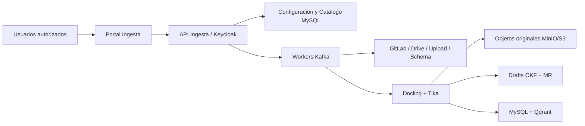

# ReqSpec / PRD — Portal de Ingesta de Conocimiento

**Versión:** 1.0  
**Fecha:** 30 de agosto de 2026  
**Estado:** Aprobado para implementación  
**Producto:** Knowledge Management para Desarrollo de Software — COMSATEL

## 1. Propósito

Construir un portal interno para configurar, ejecutar, monitorear y gobernar la ingesta de conocimiento desde GitLab, Google Drive, cargas manuales y catálogos de esquemas hacia la plataforma KM. El portal no es fuente de verdad: GitLab conserva la evidencia oficial y OKF v0.2 conserva conocimiento curado.

## 2. Objetivos

- Permitir seleccionar explícitamente proyectos/repositorios GitLab y carpetas Google Drive.
- Ingerir PDF y Markdown de forma incremental, idempotente y trazable.
- Generar conceptos OKF v0.2 como `draft` y abrir/proponer Merge Requests para revisión humana.
- Ofrecer visibilidad operacional, reproceso controlado y gestión de errores sin exponer secretos.

## 3. Alcance MVP

Incluye: administración de conectores, selección de fuentes, inventario, ejecución inicial e incremental, estado por documento, cola de errores, extracción PDF/Markdown, hashes/versiones, clasificación, ACL, generación de candidatos OKF, enlaces a GitLab/Drive y dashboard de métricas.

Excluye: edición directa de contenido `stable`, aprobación automática, ingesta de datos operativos de BD, acceso a secretos desde UI, edición de documentos Drive/GitLab y GraphRAG/Neo4j.

## 4. Arquitectura

El portal TypeScript/Node.js usa React para UI, Fastify para API, Zod para contratos, MySQL 8.x para catálogo, Kafka para trabajos y Qdrant para proyecciones recuperables. Se despliega en OKE privado con Keycloak, Vault y OpenTelemetry/Grafana/Loki/Tempo.

## 5. Roles

| Rol | Permiso |
|---|---|
| Administrador KM | Conectores, fuentes, políticas y reprocesos |
| Curador/Responsable de dominio | Revisión de drafts y aprobación mediante MR |
| Operador | Ejecutar/suspender ingestas autorizadas y tratar errores |
| Auditor | Lectura de inventario, trazabilidad y métricas |

## 6. Requisitos funcionales

| ID | Requisito |
|---|---|
| FR-01 | Configurar conectores GitLab, Drive, upload y esquema sin mostrar credenciales. |
| FR-02 | Seleccionar repos/proyectos y rutas; seleccionar carpetas Drive explícitas. |
| FR-03 | Descubrir inventario, permisos, tipo, hash, revisión, tamaño y fecha. |
| FR-04 | Ejecutar escaneo inicial, sincronización incremental y reproceso por ítem. |
| FR-05 | Deduplicar por `sourceId + revision + SHA-256`; procesar idempotentemente. |
| FR-06 | Extraer PDF/Markdown estructurado; usar Docling y Tika como fallback. |
| FR-07 | Conservar binario original, texto normalizado, página/sección, ACL y procedencia. |
| FR-08 | Generar conceptos OKF `draft` con fuentes, relaciones y `stale_after`. |
| FR-09 | Crear MR de propuesta; solo CI tras aprobación publica `stable` al índice. |
| FR-10 | Mostrar estados: queued, processing, indexed, draft-created, failed, skipped, stale. |
| FR-11 | Gestionar fallos con código, causa, reintento exponencial, DLQ y reproceso autorizado. |
| FR-12 | Ingerir MySQL/PostgreSQL/MongoDB solo como metadata y schema por defecto. |

## 7. Seguridad y gobierno

OAuth 2.1/OIDC con Keycloak. RBAC/grupos y ACL por fuente/artefacto. Secretos en Vault con referencias estándar (`secrets/kb/...`); nunca se devuelven, registran ni embeben. Antivirus, límites de archivo/páginas, aislamiento de OCR y sanitización. Todo contenido es no confiable; no puede activar acciones. Auditoría registra identidad, fuente, operación, resultado y correlation ID sin tokens ni cuerpos documentales.

Precedencia: GitLab evidencia oficial; Drive referencia; OKF conocimiento curado. Cualquier contradicción se registra para revisión, sin sobrescribir automáticamente.

## 8. Datos mínimos

`source, source_id, source_uri, revision, content_hash, connector_id, product, domain, classification, acl_principals, artifact_type, status, locator, original_uri, normalized_uri, job_id, retry_count, error_code, ingested_at, stale_after, okf_concept_id, merge_request_url`.

## 9. Criterios de aceptación

1. Un operador autorizado selecciona un repo y carpeta, ejecuta ingesta y consulta progreso por documento.
2. El mismo archivo/revisión no se procesa dos veces.
3. Un PDF recupera página/sección; un Markdown conserva jerarquía y bloques de código.
4. Un candidato OKF queda `draft` con fuentes y una MR; sin aprobación no llega a `stable`.
5. Un usuario no autorizado no ve fuentes ni metadata restringida.
6. Una falla recuperable llega a DLQ con diagnóstico y puede reprocesarse sin duplicación.
7. El schema de BD se ingiere sin filas, credenciales ni datos operativos.

## 10. Incrementos

| Incremento | Resultado |
|---|---|
| I1 | Base portal, Keycloak, catálogo, GitLab/Drive y jobs Kafka |
| I2 | Extracción, almacenamiento original, hashes, ACL, errores y dashboard |
| I3 | Compiler OKF, MR, CI y publicación controlada a MySQL/Qdrant |
| I4 | Esquemas BD, evaluación de calidad, hardening y piloto |

## 11. Definición de terminado

El portal queda terminado al operar en QA con OKE/Keycloak/Vault, ingerir corpus controlado GitLab+Drive, generar drafts OKF mediante MR, preservar procedencia/ACL, aprobar las pruebas funcionales y de seguridad, y publicar métricas y auditoría operativa.
